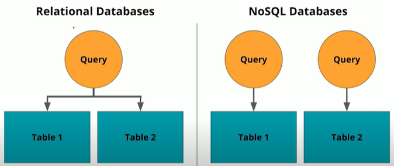

# Chapter 2: Data Modeling

## Lesson 1: Introduction to Data Modeling

**Databases:** A database is a structured repository or collection of data that is stored and retrieved electronically for use in applications. Data can be stored, updated, or deleted from a database.

**Database Management System (DBMS):** The software used to access the database by the user and application is the database management system. Check out these few links describing a DBMS in more detail. In case of Relational, then RDBMS.

**Data Model(ing):** an abstraction that organizes elements of data and how they relate to each other. Data modeling is an iterative process. Data modeling easily translates to database modeling, which is the essential end state. Data modeling is important for later data usage. We want simple and straightforward querying.

1. Conceptual models: e.g. ER-diagram
2. Logical data models: e.g. tables, schemas, columns
3. Physical data models: transforming the logical data model to the data definition language (DDL).

### 1.1 Relational databases
Two types of databases: relational and NoSQL.

A relational database organizes data into one or more tables (relations) of columns (attributes) and rows (tuples), with a unique key identifier for each row. Examples: PostgreSQL, Oracle, Teradata, MySql, Sqlite. A schema is a collection of tables in some database terminology.

Advantages:
1. Ease of use SQL
2. Ability to do JOINS
3. Ability to do aggregations and analytics
4. Smaller data volumes
5. Easier to change business requirements.
6. Flexibility for queries
7. Modeling the data, not the queries
8. Secondary indexes for data retrieval
9. ACID transactions: data integrity/correctness and guarantee validity

ACID properties:
* Atomicity: all or nothing
* Consistency: transactions must abide constraints and rules
* Isolation: transactions are processed independently
* Durability: completed transactions (once committed) are saved even after system failure

When not to use:
1. Have lots of data. They are not distributed databases. They can only scale vertically. You cannot add more machines like in NoSQL databases.
2. Need to store different data type formats. Not designed to handle unstructured data.
3. Need fast reads. ACID brings advantages, but also downsides on reading and writing speeds.
4. Need a flexible schema. Flexble schemas allow for columns to be added that do not have to be used by every row, saving disk space
5. Need high availability, so little or now downtime. Relational databases have a single point of failure.
6. Need horizontal scalability: i.e. add more machines or nodes to a system to increase performance and space (e.g. in the cloud).

### 1.2 PostgreSQL
Open source object-relational database system using SQL. SQL syntax slightly differs between systems. In the course they use jupyter notebooks and python wrappers (psycog2: https://pynative.com/python-postgresql-tutorial/ , documentation: http://initd.org.psycopg), but you can also do it in the postgres shell.

Steps during Notebook demo:
1. Create a connection to the database
2. Create a cursor object to execute queries
3. Test a query and commit it (they set autocommit=True). One transaction can contain multiple actions, but by setting autocommit, it will commit after each action. If you don't use autocommit, then you get this error message: 'CREATE DATABASE cannot run inside a transaction block'
4. Close cursor
5. Close connection

### 1.3 Non-relational Databases
(Not Only SQL) NoSQL databases and non-relational databases are interchangeable terms. NoSQL databases have simpler design, simpler horizontal scaling, finer control of availability. Operations are faster. There are different types. During the 2000's they became more popular since data increased and downtime reached more acceptable levels.

Types of NoSQL databases:
* Apache Cassandra (partitioned row storage)
* MongoDB (document store, easy to do search on)
* DynamoDB (key-value store)
* Apache HBase (wide column store)
* Neo4J (graph database)

When to use a NoSQL database:
* Have large amounts of data (big data)
* Need high data availability without downtime
* Need quick scaling (horizontal: more nodes/servers for performance)
* Need fast read and writes (select and insert)
* Need a flexible schema
* Need to store different types of data
* When users are distributed and you want to provide low latency (data transfer delays)

When not to use NoSQL database:
* Need ACID transactions (there are however some NoSQL databases that do offer this)
* Need to do JOINS
* Need to do aggregations and analytics (can be done using Apache Spark with Apache Cassandra)
* Have changing business requirements
* Queries are not available and need to have Flexibility
* Not created for small datasets

Terminology:
* Keyspace: collection of tables ('the database')
* Table: group of partitions
* Row: single item
* Partition: fundamental unit of access, collection of rows, how the data is distributed
* Primary key: made up of partition key and clustering columns
* Columns: clustering and data columns, labeled element

### 1.4 Apache Cassandra
"Provides scalability and high availability with high performance. Linear scalability and proven fault-tolerance make it the ideal platform for mission-critical data" Uses its own query language: CQL, which is very similar to SQL. Used by Uber, Netflix. It is optimized for **writes**. Used Python wrapper: cassandra-driver.

Installation: https://cassandra.apache.org/doc/latest/getting_started/installing.html

Good use cases:
1. Transaction logging (retail, health care)
2. Internet of Things (IoT)
3. Time series data
4. Any heavy-write workload

Keyspace has specifications:
* Replication factor: how often the data is replicated over additional/other nodes

Partition key: if you want to filter on a year, i.e. WHERE year = 1970, then you need to specify the year as the partition key.

*For NoSQL databases, you must model your queries fist ('model your tables to suit your queries'), while in relational databases you design your schema (and ER-diagram) and then you can run any query.*

Cassandra does not allow duplicates.

Workflow:
1. Import the cassandra wrapper
2. Create a connection to the database
3. Create a Keyspace
4. Connect to the Keyspace
5. Run some queries
6. Shutdown session
7. Shutdown cluster

## Lesson 2: Relational Data Models

### 2.1 OLAP vs OLTP
Online Analytical Processing (OLAP): type of database optimized for complex analytics (queries) and ad hoc queries. Optimized for reads.

Online Transactional Processing (OLTP): type of database optimized for less complex queries in large volume. Queries as read, insert, update, and delete.

### 2.2 Structuring the Database: Normalization
Use Normalization to reduce data redundancy and increase data integrity. Should feel like a natural process, although 3NF might feel less natural. Objectives:
1. To free the database from unwanted insertions, updates, and deletion dependencies.
2. To reduce the need to refactoring the database as new types of data are introduced (you want to be able to just a new table and use a foreign key).
3. To make the relational model more informative to users
4. To make the database neutral to query statistics

Denormalization must be done in read heavy workloads to increase performance. Feels less natural and can lead to duplicates.

#### 1NF
* Atomic values: unique and single values (no sets, collections, or lists in a column)
* Able to add data without altering the tables
* Separate different relations into different tables (e.g. a customer and a sales table)
* Keep relationships between tables together with foreign keys (e.g. customer_id as foreign key in the sales table)

#### 2NF
* All columns in the table must rely on the primary key, so the PK must be unique (lesson 2 demo 1 gives an example)

#### 3NF
* No transitive dependencies

If you want to update data, you want to do it in just 1 place. Therefore, you use 3NF.

**3NF: the maximum normal form that should be attempted while doing practical data modeling**

## 2.3 Denormalization
Useful when using heavy reads (select) on your database where you want to avoid slow JOINS. Denormalization comes after normalization. This is at the expense of writing (insert, update, delete) performance (and complexity) by having redundant data. Try to reduce the number of JOINS.

## 2.4 Fact and Dimension tables
Fact and Dimension tables together create a Data Model. Fact tables consists of the measurements, metrics or facts of a business process. "made up of facts", things that actually happened, e.g. transactions. Fact tables show **foreign keys** to dimension tables. Dimension: a structure that categorizes facts and measures in order to enable to answer business questions, e.g. people, products, place, time. It answers the When, Who, and What.

Two of the most popular schemas for data warehouses are:
1. Star schema
2. Snowflake schema

#### Star Schema
The simplest style of data mart schema, and consists of one on more fact tables referencing any number of dimension tables. Fact tables are in the center, and surrounded by dimensions. It is a simplified Snowflake.

Benefits:
* Denormalized
* Simplifies queries
* Fast aggregations: the Star schema allows to make queries. For any basic query, you are actually making these kind of schemas by making joins and extracting data from it.

Drawbacks due to Denormalization:
* Issues that are part of Denormalization
* Data integrity
* Decreased query Flexibility
* Many-to-many: it is designed for one-to-one relations, not one-to-many or many-to-many.

#### Snowflake Schema
Logical arrangement of tables in a multi-dimensional database represented by centralized fact tables which are connected to multiple dimensions. So multiple levels of dimensions (parent-child). This is where the name comes from. It is more normalized than the Star schema, but only in 1NF or 2NF.

## 2.5 Constraints
There are multiple contraints possible for the CREATE statement:
* NOT NULL
* UNIQUE: on 1, or multiple columns (e.g. UNIQUE (customer_id, store_id, spent))
* PRIMARY KEY (group of columns is called Composite Key): by default has **both** the NOT NULL and UNIQUE constraints in it.

UPSERT: terminology for UPDATE and INSERT on an existing table. When there is a conflict in the data, you have multiple options that you can add to the INSERT statement:

* ON CONFLICT (customer_id) DO NOTHING;
* ON CONFLICT (customer_id) DO UPDATE SET customer_street  = EXCLUDED.customer_street;

## Lesson 3: Data Modeling for Non-Relational Databases (NoSQL)

**When to NOT use SQL:**
* Need high availability in the data: system always up and running
* Have large amounts of data
* Need for linear scalability: increase performance linearly by increasing more nodes (servers, VMs, Docker container, etc.)
* Low latency: short data transfer delays
* Need fast reads and writes

**Apache Cassandra**
* Open source - downnloadable
* Created at Facebook to handle big data challenges
* Used by Uber, Netflix, Twitter, Facebook, etc.
* Every node in Cassandra is connected to every node (=peer-to-peer database architecture)
* Will be using the cassandra-driver for Python.

**Distributed databases**
In a distributed database, a horizontally scaled database, you will need copies of the data to have high availability (nodes will fail).

**Eventual consistency**
A consistency model in distributed computing to achieve high availability that informally guarantees that, if no new updates are made to an item, all accesses to that item will return the last updated value, i.e. each copy of the data is the same. If there are new changes, the data may be different in different locations (for the duration of milliseconds).

**CAP Theorem**
Theorem saying its impossible for a distributed data store to simultaneously provide more than 2 out of 3 guarantees: consistency (every read gives the latest and correct piece of data or an error), availability (every request is received and responded to - ignoring whether that data is the latest update), partition tolerance (system continues to work regardless of losing network connectivity). Cassandra suits availability (linearly scalable) and partition tolerance. It is optimized for fast writes.

**Denormalization**
Critical in Apache Cassandra. Think about the queries that you want to make on the database, they are leading for the design and you need to know this in advance. Making JOINS is not possible in Cassandra. Using 1 table per query is a good strategy.

**CQL: Cassandra Query Language**
Very similar to SQL, but lacks JOINS, GROUP BY and subqueries.

**Terminology (more in CH 1.3 and 1.4)**
* Cluster: database connection
* Keyspace: collection of tables (database). Connecting to the Keyspace is like ssetting up a session in Postgres.
* Clustering column: makes the primary key unique.

**Primary Key**
The first element of the primary key is the partition key. The PRIMARY KEY is made up of either just the PARTITION KEY or may also include additional CLUSTERING COLUMNS. A Simple PRIMARY KEY is just one column that is also the PARTITION KEY. A COMPOSITE/COMPOUND PRIMARY KEY is made up of more than one column and will assist in creating a unique value in your retrieval queries. The PARTITION KEY will determine the distribution of data across the system. The partition key's row value will be hashed (turned into a number) and stored on the node in the system that holds that range of values.

**Clustering columns**
The clustering column sorts the data in ascending order. If more than 1 clustering columns is used, the data is sorted based on the order of adding clustering columns to the primary key. Example of a COMPOSITE KEY consisting of multiple PARTITION and CLUSTERING keys:
`PRIMARY KEY((k_part_one, k_part_two), k_clust_one, k_clust_two, k_clust_three)`

* The `Partition Key` is responsible for data distribution across your nodes, and is the minimum-specifier needed to perform a query using a `where` clause, so you always need to specify the partition key in the query. It is the primary lookup to find a set of rows, i.e. a partition.
* The `Clustering Key` is responsible for data sorting within the partition.
* The `Primary Key` is equivalent to the Partition Key in a single-field-key table (i.e. Simple).
* The `Composite/Compound Key` is just any multiple-column primary key

Additional information: https://docs.datastax.com/en/landing_page/doc/landing_page/current.html

**WHERE clause**
Data modeling in Cassandra is query focused where the focus is on the WHERE clause. Add the columns in the same order to the WHERE clause as they were added to the primary key. You cannot use only the last clustering columns, you will have to use them all. You can use only the first clustering column. The WHERE statement allows us to do fast reads.
