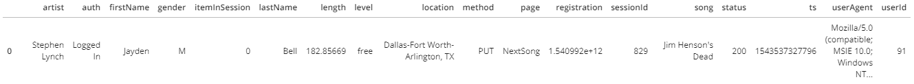

# Project 1: Data Modeling with Postgres

## Project Introduction
Startup Sparkify wants to analyze the data from collected from its music streaming app. The data consists of songs and user activity on the app. They mainly want to understand to what songs the users are listening to. For this purpose, Sparkify wants a Postgres database optimized for queries to perform songplay analysis. I designed a database schema and ETL pipeline. The database contains all relevant data in a fact table and dimension tables.

## Data
The data consists of JSON logs on user activity on the app, as well as JSON metadata of the songs.

### Song Data
The song data is a subset of the Million Song Dataset. Each JSON file contains metadata about a song and its artist. Files are partitioned by the first three letters of each song's track ID.

*Example:*
>song_data/A/B/C/TRABCEI128F424C983.json

*Content:*
> {"num_songs": 1, "artist_id": "ARJIE2Y1187B994AB7", "artist_latitude": null, "artist_longitude": null, "artist_location": "", "artist_name": "Line Renaud", "song_id": "SOUPIRU12A6D4FA1E1", "title": "Der Kleine Dompfaff", "duration": 152.92036, "year": 0}

### Log Data
The user activity data consists of log files in JSON format partitioned by year and month.

*Example:*
> log_data/2018/11/2018-11-12-events.json

*Content:*

## Database Schema

#### Fact Table
1. **songplays**: stores log data of song plays
  * Attributes: songplay_id, start_time, user_id, level, song_id, artist_id, session_id, location, user_agent

#### Dimension Tables
2. **users**: app users
  * Attributes: user_id, first_name, last_name, gender, level
3. **songs**: songs
  * Attributes: song_id, title, artist_id, year, duration
4. **artists**: artists
  * Attributes: artist_id, name, location, latitude, longitude
5. **time**: timestamps of the songplay records broken up into different timeunits
  * Attributes: start_time, hour, day, week, month, year, weekday

## Files
This repository contains the following files:
1. `create_tables.py` creates the database, sets up the connection, drops tables, and creates tables. Run this file each time you want to reset the tables.
2. `sql_queries.py` contains all sql  queries to drop and create database tables and insert records, and combines them in query lists `create_table_queries, drop_table_queries`. This file is used as input for `create_tables.py, etl.ipynb, etl.py`.
3.`etl.py` reads and processes files from `song_data` and `log_data` and loads them into the database tables.
4. `etl.ipynb` notebook used to develop the ETL processes as used in `etl.py`
5. `test.ipynb` tests the correct functioning of the database.

## Usage
To create the database using the files from this repository, do the following:
1. Run `create_tables.py` in the terminal.
2. Run `etl.py` in the terminal.
3. Open `test.ipynb` in your Jupyter Notebook to test the database content and run some example queries.
